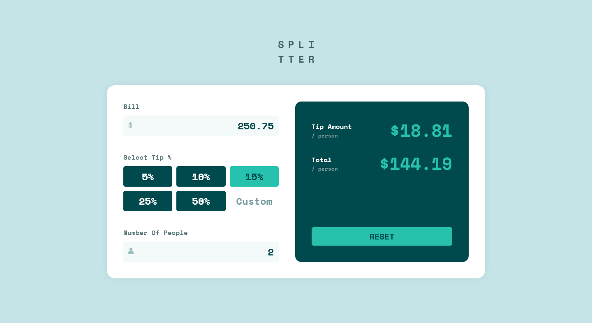
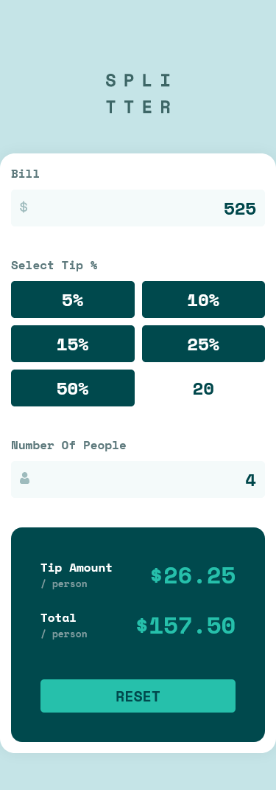

# Frontend Mentor - Tip calculator app solution

This is a solution to the [Tip calculator app challenge on Frontend Mentor](https://www.frontendmentor.io/challenges/tip-calculator-app-ugJNGbJUX). Frontend Mentor challenges help you improve your coding skills by building realistic projects.

## Table of contents

- [Frontend Mentor - Tip calculator app solution](#frontend-mentor---tip-calculator-app-solution)
  - [Table of contents](#table-of-contents)
  - [Overview](#overview)
    - [The challenge](#the-challenge)
    - [Screenshot](#screenshot)
    - [Links](#links)
  - [My process](#my-process)
    - [Built with](#built-with)
    - [What I learned](#what-i-learned)
    - [Continued development](#continued-development)
    - [Useful resources](#useful-resources)
  - [Author](#author)

## Overview

### The challenge

Users should be able to:

- View the optimal layout for the app depending on their device's screen size
- See hover states for all interactive elements on the page
- Calculate the correct tip and total cost of the bill per person

### Screenshot

### Links

- Solution URL: [Add solution URL here](https://github.com/Nghuynh07/tip_calculator)
- Live Site URL: [Add live site URL here](https://gilded-arithmetic-ec0e2c.netlify.app/)

## My process

1. npx create-react-app
2. npm i sass
3. Add folders: SASS/SCSS, components, images
4. Add JSX file to components: 2 main JSX files: Bill.js and Tip.js and Calculator.js as the parent element as container
5. HTML5 markup. This includes add classes using BEM style, group elements together using css box-model
6. Styling using SCSS and add Media queries only when layout breaks
7. Adding logic to the calculator:

   - I started out by ensuring all user's input and click events of the buttons are working correcting as intended by console.log().
   - For the tip % I use dataset attribute and use the synthetic DOM to get the value of the tip then convert into Number() for calculations
   - After that is just a matter of simple calculations and the order of logics

### Built with

- Semantic HTML5 markup
- CSS custom properties
- Flexbox
- CSS Grid
- [React](https://reactjs.org/) - JS library
- SCSS

### What I learned

- I have been on and off with react; however, this project I reviewed a lot on the useState and the useEffect hook.
- I learned about onFocus onBlur and use it to change the border of the container.
- The logic of calculator itself requires a little of thinking and logic but I was able to figure out.

### Continued development

- As I progress through the project, sending data using props become tedious. Refractor into contextAPI can be a better solution. Can also build custom hooks for reusable code as well

### Useful resources

- Input styling and removing default appearance - https://developer.mozilla.org/en-US/docs/Web/HTML/Element/input/number

- React Synthetic Event onFocus onBlur - https://reactjs.org/docs/events.html#focus-events

## Author

- Website - [Huynh Nguyen](https://huynhtn.com/)
- Frontend Mentor - [@Nghuynh07](https://www.frontendmentor.io/profile/Nghuynh07)
- Twitter - [@huyniewin](https://twitter.com/huyniewin)
